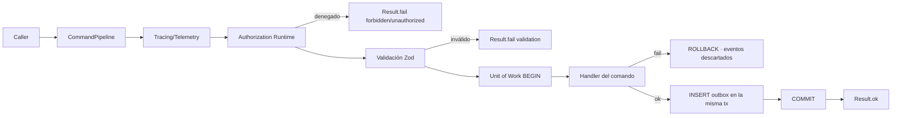
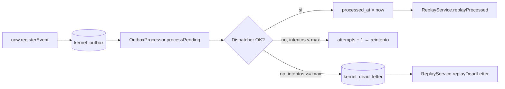
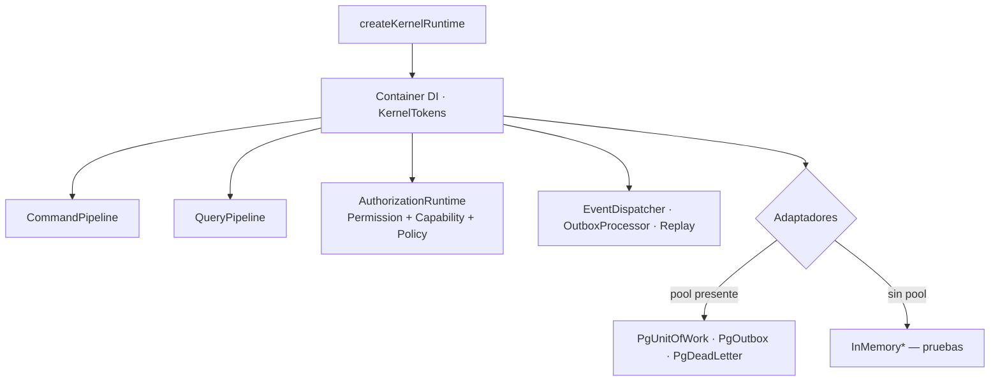

# DeltaOps — Kernel Ejecutable (DGP-002)

Librería: `lib/kernel` (`@workspace/kernel`). Cero dominio: solo infraestructura
reutilizable para todos los módulos futuros. Los módulos importan únicamente
desde el barril `@workspace/kernel`.

## Componentes

| # | Componente | Ubicación |
|---|---|---|
| 1 | Kernel Runtime (`createKernelRuntime`) | `src/runtime.ts` |
| 2 | Execution Context (principal, correlación, traza) | `src/context.ts` |
| 3 | Result Pattern (`Result`, `ok/fail/map/flatMap`) | `src/result.ts` |
| 4 | Error Pattern (taxonomía `KernelErrors`, códigos estables) | `src/errors.ts` |
| 5 | Command Pipeline (tracing→logging→authz→validación→UoW→handler) | `src/pipeline.ts` |
| 6 | Query Pipeline (solo lectura, sin transacción) | `src/pipeline.ts` |
| 7 | Dependency Injection (`Container`, tokens, ciclos de vida, ámbitos) | `src/container.ts` |
| 8 | Repository Base (`RepositoryPort`, `InMemoryRepository`) | `src/ports.ts`, `src/adapters/memory.ts` |
| 9 | Unit Of Work (eventos atómicos con los datos) | `src/ports.ts`, adaptadores |
| 10 | Event Dispatcher (suscripción nombrada, fallo aislado) | `src/events/dispatcher.ts` |
| 11 | Outbox (persistencia transaccional + drenaje con reintentos) | `src/events/outbox.ts` |
| 12 | Replay (procesados y dead letter) | `src/events/outbox.ts` |
| 13 | Dead Letter (entierro tras `maxAttempts`) | `src/events/outbox.ts` |
| 14 | Base Ports (Clock, IdGenerator, Logger, Repository, UoW, Config, Outbox, DeadLetter) | `src/ports.ts` |
| 15 | Base Adapters (memoria y PostgreSQL) | `src/adapters/` |
| 16 | Authorization Runtime | `src/auth.ts` |
| 17 | Capability Resolver (capacidad → permisos) | `src/auth.ts` |
| 18 | Permission Resolver (rol + permisos directos, comodín `*`) | `src/auth.ts` |
| 19 | Configuration Resolver (capas con precedencia, tipado) | `src/config.ts` |
| 20 | Policy Engine (reglas contextuales con razón de denegación) | `src/auth.ts` |
| 21 | Transaction Runtime (`PgUnitOfWork`: BEGIN/COMMIT/ROLLBACK + outbox atómico) | `src/adapters/pg.ts` |
| 22 | Telemetry (contadores + duraciones) | `src/telemetry.ts` |
| 23 | Logging (`LoggerPort`, Console/Memory) | `src/telemetry.ts` |
| 24 | Tracing (`Tracer`, spans jerárquicos por traza del contexto) | `src/telemetry.ts` |

Persistencia del Kernel: `deltaops.kernel_outbox` y `deltaops.kernel_dead_letter`
(migraciones `0002_kernel_outbox.sql` y `0003_kernel_outbox_claim.sql`, espejo
Drizzle en `lib/db/src/schema/deltaops-kernel.ts`).

## Garantías y obligaciones de los módulos

- **Atomicidad datos+eventos:** los repositorios PostgreSQL DEBEN escribir con
  la sesión del Unit of Work — `pgSessionOf(uow)` — nunca con el Pool directo.
  Así fila y evento confirman o revierten en la MISMA transacción (probado en
  `kernel.pg.test.ts`).
- **Entrega al-menos-una-vez:** el outbox reclama con lease atómico
  (`FOR UPDATE SKIP LOCKED` + `claimed_until`, 60 s) — seguro con procesadores
  concurrentes — pero un manejador puede recibir un evento más de una vez
  (expiración de lease, replay). TODO manejador de eventos DEBE ser idempotente.
- **Dead letter sin ventana:** el entierro y la confirmación del outbox ocurren
  en una sola transacción (`markDead`).

## Diagramas

### Flujo de un comando



### Ciclo de vida de un evento



### Composición del runtime



## Uso por módulos futuros

```ts
const runtime = createKernelRuntime({ pool, rolePermissions, capabilityMap });
runtime.commands.register({ name, inputSchema, authorization, handle });
runtime.queries.register({ ... });
runtime.dispatcher.subscribe("evento.tipo", "nombre-manejador", handler);
await runtime.commands.execute(ctx, "modulo.accion", input); // → Result<T>
```

Ningún módulo instancia adaptadores ni abre transacciones por su cuenta: todo
pasa por los pipelines y puertos del Kernel.

## Checklist de aceptación (DGP-002)

- [x] Command Pipeline operativo — tests + `kernel:demo` paso 1
- [x] Query Pipeline operativo — tests + demo paso 3
- [x] Unit Of Work funcionando — rollback de eventos probado; transacción PG real en demo
- [x] Event Dispatcher operativo — tests + demo paso 5
- [x] Outbox operativo — persistencia real en `deltaops.kernel_outbox` (demo paso 4)
- [x] Replay operativo — procesados y dead letter (tests + demo paso 6)
- [x] Dead Letter operativo — entierro tras maxAttempts en tabla real (demo paso 5)
- [x] Authorization Runtime operativo — permisos, capacidades y políticas (tests + demo paso 2)
- [x] Result Pattern operativo — todo el Kernel retorna `Result`
- [x] Tests del Kernel en verde — `pnpm --filter @workspace/kernel run test` (27 pruebas)
- [x] Kernel completamente desacoplado del dominio — sin imports de SGMA/DeltaOps app; entidades de prueba sintéticas

Demostración ejecutable: `pnpm --filter @workspace/scripts run kernel:demo`
(corre contra PostgreSQL real y limpia sus eventos sintéticos al final).
