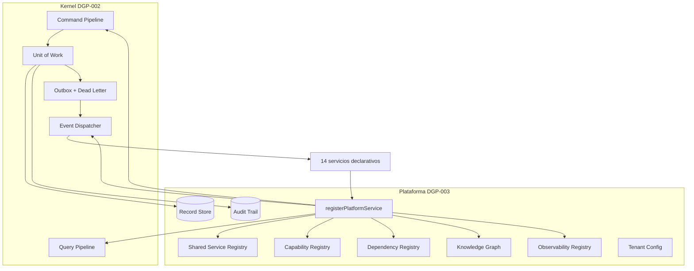

# Arquitectura de la Plataforma (DGP-003)

## Visión general

## Decisiones de arquitectura

### 1. Record Store genérico (decisión deliberada)

En lugar de ~30 tablas por servicio, la plataforma persiste en **una tabla
genérica multitenant** `deltaops.platform_records`
(`tenant_id, service, record_type, status, data jsonb, version, …`), más
`deltaops.platform_audit` para la auditoría.

**Por qué:**
- Los servicios de plataforma almacenan *metadatos de infraestructura*
  heterogéneos y de esquema evolutivo (plantillas, jobs, etiquetas, widgets…),
  no entidades de negocio con integridad referencial compleja.
- Concurrencia optimista, borrado lógico, RLS, índices y auditoría se
  implementan y prueban **una sola vez** y todos los servicios los heredan.
- Añadir un servicio nuevo no requiere migración: solo declara sus
  `recordTypes` en el descriptor.

**Límite consciente:** los módulos de negocio futuros (DGP-004+) NO deben usar
el Record Store para sus entidades; tendrán tablas propias con esquema fuerte.

### 2. Descriptores declarativos + registro automático

Cada servicio es un `PlatformServiceDefinition` puro (comandos, consultas,
eventos, capacidades, permisos, configuración, health check).
`registerPlatformService()` deriva de él TODO el registro: pipelines del
Kernel, suscripciones de eventos y los cinco registros. Las escrituras a los
registros están selladas con un `Symbol` privado: **el registro manual está
prohibido y falla** (verificado por tests).

### 3. Timeline e Import: pureza de flujo

- `platform.timeline` **nunca** se escribe directamente: solo proyecta eventos
  (idempotente por `event.id`) y puede reconstruirse desde la auditoría.
- `platform.import` ejecuta cada fila **a través del pipeline de comandos**
  (`runtime.commands.execute`), heredando validación zod, autorización,
  UoW y auditoría; jamás escribe directo a la base.

### 4. Autorización y capacidades

Los permisos viajan en el `Principal` (cadenas `platform.<svc>.<acción>`), el
`PermissionResolver` del Kernel los aplica. Las capacidades se registran como
metadatos en el Capability Registry (el CapabilityResolver del Kernel es de
mapa fijo por diseño DGP-002; no se modificó el Kernel).

### 5. Configuración por tenant

Precedencia: **override del tenant** (Record Store, `platform.config`) →
**default del servicio** (descriptor) → **configuración global del Kernel**
(entorno). Expuesta a los servicios vía `deps.tenantConfig`.

### 6. Credenciales

`platform.integration` guarda únicamente **referencias** a credenciales
(`credencialRef`); los secretos reales viven en el gestor de secretos del
entorno. Nunca se persisten secretos en claro.

## Compatibilidad DGP-002

- Sin cambios en `@workspace/kernel`.
- Los eventos usan el outbox existente (`deltaops.kernel_outbox`,
  `kernel_dead_letter`) con semántica at-least-once y handlers idempotentes.
- Migración `0004_platform_services.sql` es aditiva; RLS y versionado
  coherentes con el patrón de las migraciones 0001–0003.

## Correcciones tras la revisión de arquitectura (DGP-003)

1. **RLS operativo**: los adaptadores PostgreSQL fijan
   `set_config('app.tenant_id', <tenant>, true)` (transaccional) antes de
   cada escritura de registros y auditoría, de modo que las políticas RLS
   apliquen también con roles de aplicación sin BYPASSRLS. Las lecturas
   siguen parametrizadas por `tenant_id`.
2. **Consola Técnica autenticada**: todos los endpoints
   `/api/deltaops/platform/*` exigen sesión DeltaOps (401 sin sesión).
3. **Registro sellado**: `registrarKey` ya no se exporta en la API pública
   del paquete; `registerPlatformService()` es la única vía de registro
   accesible a consumidores.
4. **Timeline**: `rebuild` solo reproyecta entradas de auditoría mapeadas
   1:1 con los eventos proyectables (`AUDIT_TO_EVENT`), preservando el
   contrato "reconstruible desde eventos".
5. **Import idempotente**: el avance por fila se persiste en transacción
   propia (`filasImportadas`); un reintento tras fallo omite las filas ya
   aplicadas y no duplica efectos.
6. **URLs firmadas**: sin `SESSION_SECRET` el comando falla explícitamente;
   se eliminó el secreto de respaldo predecible.
